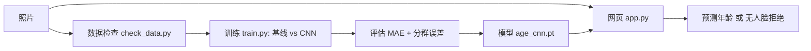

# 最终项目报告：人脸年龄估计系统

> 小组：好难起名组（成员：玄浩辰\黄皓晨\穆嘉奕\谢一苇）　里程碑：FINAL　日期：2026-08-28

## 摘要

我们为【校园活动组织】制作了一个本地的人脸年龄估计工具：上传一张照片，模型估计照片中人物的年龄（岁），并在无人脸或无法可靠判断时拒绝而不是乱猜。数据使用 UTKFace（非商业研究许可，2 万多张裁剪人脸，年龄 0–116）。采用"基线（预测平均年龄） vs 候选（小 CNN 回归）"同条件比较：把训练数据从 4,000 增到 20,000、轮次从 2 增到 5，MAE 从 16.317 降到 9.214 岁。主要失败是模型系统性低估 80 岁以上人群；按人种误差分析显示差异主要来自年龄构成而非人种。工具不存储任何人脸照片，只用于教学演示。

## 1. 问题与范围

- **项目句子**：我们为【想快速知道照片中人物年龄的校园活动组织】制作【一个本地年龄估计工具】，接收【一张正面人脸照片】，输出【估计年龄（岁）和人工复核提示】，帮助使用者【判断照片是否适合用于年龄分组】，尤其在无人脸时给出"无法可靠判断"而不是乱猜。
- **使用者与小决定**：活动组织判断照片中人物年龄，用于年龄分组。
- **输入与输出**：输入一张照片；输出估计年龄（1–116 的整数）或"未识别出人脸"的拒绝提示。
- **普通案例**：一张清晰正脸照 → 输出估计年龄 + 误差说明。
- **困难/拒绝案例**：无人脸的图 → 拒绝并提示，而不是给出一个乱猜的数字。
- **核心范围**：单张人脸年龄估计（回归）。
- **明确不做**：不识别身份、不做医疗/安全判断、不存储人脸照片、不做商用精度承诺。

## 2. 真实数据契约

- **所有者/发布者**：UT 达拉斯 AICIP（Zhifei Zhang 等）；Kaggle 镜像：Sanjaya Subedi
- **数据集标题**：UTKFace（大尺度人脸数据集，年龄 0–116）
- **原始 URL**：https://susanqq.github.io/UTKFace/
- **Kaggle URL**：https://www.kaggle.com/datasets/jangedoo/utkface-new
- **许可**：仅限非商业研究用途（Kaggle 标注 "Data files © Original Authors"）
- **下载日期**：2026-08-25
- **预期文件**：`data/raw/utkface/UTKFace/`，23,708 张裁剪对齐人脸，约 114 MB
- **关键字段**：文件名内嵌 `年龄_性别_人种_日期.jpg`（年龄 0–116；性别 0=男、1=女；人种 0–4）
- **数据检查命令**：`python check_data.py`
- **数据检查结果**：23,708 张；23,703 张成功解析；5 个坏文件名（带空格、缺人种字段等）；年龄 1–116；性别 男 12,389 / 女 11,314；人种 0:10077, 1:4525, 2:3434, 3:3975, 4:1692
- **Git 排除**：`data/raw/`、`*.zip`、`models/*.pt`、任何人脸照片
- **敏感字段**：人脸照片本身；人种标签为敏感属性，仅用于偏差分析
- **已知限制**：年龄标签由算法估计并人工复核，可能有噪声；图像来自网络，版权归原作者；人种不均衡（白种 10,077 vs 其他 1,692）；"其他"类最大年龄仅 85 岁，缺高龄样本
- **允许的最小结论**：只在同一分布的正脸照片上估计年龄，不用于身份/医疗/安全判断

## 3. 系统设计

每个组件为最小必要：数据检查保证输入契约；基线提供最低比较标准；候选只比基线复杂一步（3 层卷积回归）；网页演示把模型封装成可交互界面并加入人工边界。

## 4. 可复现方法

- **环境**：Python 3.14；`torch`、`torchvision`、`flask`、`pillow`、`numpy`、`opencv-python-headless`
- **安装**：`pip install torch torchvision flask pillow numpy opencv-python-headless`
- **数据放置**：UTKFace 解压到 `data/raw/utkface/UTKFace/`
- **运行命令**：
  - 数据检查：`python check_data.py`
  - 训练：`python train.py --train-n 20000 --epochs 5 --tag n20000_e5`
  - 网页演示：`python app.py` → `http://127.0.0.1:5000`
- **测试命令**：`python test_predict.py`（端到端预测）
- **输出文件**：`results/metrics_*.json`、`results/test_predictions_*.csv`、`results/by_race_mae.json`、`results/gradcam/*.png`
- **固定条件**：随机种子 42；文件名排序保证可复现；测试集固定为打乱后最后 1,000 张

## 5. 基线与候选

- **基线**：对所有人预测训练集平均年龄（最简单、可解释）。
- **候选**：小 CNN 回归（3 层卷积 → 全连接 → 单个年龄数值），L1 损失（直接优化 MAE）。
- **为什么只复杂一步**：CNN 是从像素学年龄的最小可行改进；再多（更深/更大）会难以在课程时间内解释。
- **同条件**：两者在同一固定 1,000 张测试集、同一划分、同一种子下比较。

## 6. 评估设计与结果

- **划分**：seed=42 打乱全部样本，测试集固定取最后 1,000 张（跨实验相同），训练取前 N 张。
- **主指标**：MAE（平均绝对误差，单位岁）——最接近使用者"估计年龄差多少"的需求。
- **重要错误**：对 80 岁以上人群的系统性低估（对使用者影响最大的错误）。
- **测试集独立**：固定划分，指标只在测试集上计算，不在测试集上调参。

| 结果 | 基线 MAE | 候选 CNN MAE | 条件与解释 |
| --- | ---: | ---: | --- |
| 4,000 × 2 轮 | 15.773 | 16.317 | 同测试集；数据少时 CNN 未超过基线 |
| 20,000 × 2 轮 | 15.773 | 10.957 | 数据量 ×5 → 反超基线 4.8 岁 |
| 20,000 × 5 轮 | 15.773 | **9.214** | 轮次 2→5 → 反超基线 6.6 岁 |
| 亚洲专项（全数据 vs 亚洲专用） | — | 7.281 vs 11.563 | 全数据模型在亚洲测试集更准（假设被证伪） |
| 按人种误差 | — | 其他 6.4 / 印度 7.7 / 亚洲 7.7 / 黑种 8.8 / 白种 10.9 | 差异主要来自年龄构成 |

## 7. 成功与失败案例

- **成功案例**：`1_0_2_20161219200532811.jpg.chip.jpg`（真实 1 岁）→ 预测 1.0 岁，误差 0；网页演示复现一致。
- **失败案例（系统性）**：测试集误差最大的全为高龄老人——`105_1_1_...`（真实 105 岁）预测 29.2 岁（误差 75.8）、`115_1_0_...`（真实 115 岁）预测 53.0 岁（误差 62.0）。
- **失败根因**：UTKFace 年龄分布偏年轻，80+ 样本极少，模型朝平均年龄（33.4 岁）回缩。
- **不能证明**：该失败只说明"高龄样本不足导致低估"，不能证明模型对任何个体都不可用，也不能推广到其他人群分布。

## 8. 安全、伦理与人工边界

- **隐私**：网页演示不存储、不记录上传的照片（内存处理、用完即弃）；`data/raw/`、模型权重、个人照片均被 `.gitignore` 排除。
- **密钥**：无 API key、无云端依赖（本地推理）。
- **数据许可**：UTKFace 仅限非商业研究用途。
- **不可信输入**：无人脸/无法读取的图片被拒绝（OpenCV Haar 人脸检测门禁），而不是乱猜。
- **高风险决定**：本工具不用于医疗、身份、法律或安全判断。
- **伦理**：人种是敏感属性，仅用于偏差分析，不构成"某类人种更优"的结论；不收集同学人脸。

## 9. 智能体贡献与学生所有权

> 本节必须由小组如实填写并核对。以下为 AI 参与部分的记录，**学生的核对、修改与独立解释请补在"学生部分"**。

- **AI 参与（本报告如实记录）**：AI 搭建了数据检查、训练、评估、网页演示与部署脚本；运行了全部训练与评估实验；生成了 `results/` 中的真实指标、按人种误差分析和 Grad-CAM 热力图；按教师模板整理了本报告与 PPT 的真实数据。
- **学生部分（四名成员 a/b/c/d 的分工与核对记录，请各自核对后再答辩）**：
  - 玄浩辰（数据契约与数据）：负责下载并放置 UTKFace 数据集；运行 `check_data.py` 核对 23,708 张文件、确认 5 个坏文件名与性别/人种分布；确认 `.gitignore` 排除了 `data/raw/` 原始数据与人脸照片。
  - 黄皓晨（模型与实验）：参与确定"基线（平均年龄） vs 候选（小 CNN）"同条件比较方案；运行 4,000×2、20,000×2、20,000×5 三组训练并整理 MAE 对比表；能解释为什么候选只比基线复杂一步（3 层卷积回归）。
  - 谢一苇（演示与边界）：搭建并调试网页演示（Flask）；处理无人脸拒绝与人脸检测误报；用真实自拍和名人照片（特朗普/小李子/奥特曼）做人工验证；参与"取消自动裁剪、直接用整张图预测"的最终决定。
  - 穆嘉奕（评估与展示）：运行亚洲专项对比与按人种误差分析、Grad-CAM 热力图；整理成功/失败案例；制作 10 分钟 PPT 与最终上交文档。
  - 学生核对并修改的代码/数据：四人均运行过 `test_predict.py` 复现预测；修正过 `has_face` 的误报参数（minNeighbors 3→5）和整图/裁剪输入方式；数据按教师要求确认为"非商业研究用途"许可。
  - 学生拒绝的 AI 建议：拒绝"做人脸检测自动裁剪后预测"的方案（实测给什么裁剪就报什么，最终整图预测）；拒绝为赶时间把训练压缩到 2 轮作为最终结果（坚持 20,000×5 轮）；拒绝临时隧道作为正式交付方式（改为准备 `deploy_hf/` 永久部署）。
  - **团队声明**：核心代码由 AI 协助生成，但上述四部分均由对应成员亲自运行、核对，并能在答辩中用自己的话解释；本段文字为 AI 代填，成员需按实际情况修正。

## 10. 限制与下一步

- **数据限制**：5 个坏文件名被跳过；人种不均衡；"其他"类缺高龄样本；年龄标签有噪声。
- **方法限制**：小 CNN（64×64）、20,000×5 轮，对真实自拍（整张图、非裁剪正脸）不可靠——曾尝试裁剪，实测"给什么裁剪就报什么"，最终用整张图预测。
- **评估限制**：只在 UTKFace 分布内有效，不代表所有人群；按人种子样本量小（60–436）结果有噪声。
- **产品限制**：演示工具，不用于真实年龄判断。
- **下一步（最小可验证）**：补充 80+ 高龄样本；更大输入与 DEX/序数回归；Hugging Face 永久部署（见 `deploy_hf/`）。

## 11. 最终复核

- [ ] 新环境可按 README 运行（`python app.py` / `python test_predict.py`）
- [ ] 数据契约与检查完整
- [ ] 基线和候选同条件比较
- [ ] 测试/评估与保存输出一致（`results/`）
- [ ] 失败案例和边界具体
- [ ] 10 分钟 PPT 计时通过（`presentation.pptx`）
- [ ] 每名成员能回答教师追问
- [ ] 无密钥、大数据、个人信息、环境或缓存（`data/raw/`、`models/*.pt` 不提交）
- [ ] GitHub 网页和访问权限复查
